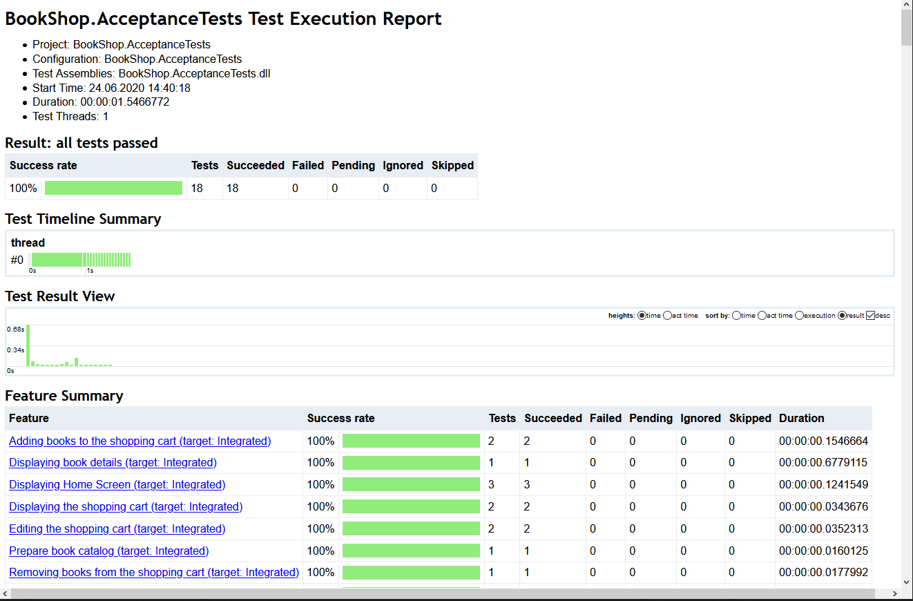

SpecFlow BookShop Example
========================

This solution contains an end-to-end example to demonstrate the usage of SpecFlow with an
[ASP.NET](https://dotnet.microsoft.com/apps/aspnet) MVC application.

You can find more information about SpecFlow at [http://www.specflow.org/](http://www.specflow.org).

Prerequisites to run the application
====================================

- [Visual Studio 2019](https://www.visualstudio.com/downloads/) or [Visual Studio Code](https://code.visualstudio.com/)
- [.NET Core 3.1 SDK](https://dotnet.microsoft.com/download/dotnet-core/3.1)

If you use Visual Studio 2019, please install the [SpecFlow extension](https://marketplace.visualstudio.com/items?itemName=TechTalkSpecFlowTeam.SpecFlowForVisualStudio) for Visual Studio.

Setup the application
=================

- Open the solution `BookShop.sln` in Visual Studio.
- Set the `BookShop.Mvc` project as startup project.
- Run the application (hit F5).

The web application should start, a new browser window should be opened, and you should see a list of books on the start page of the app.

Feel free to explore the application: try to search for a book, check the details of a selected book, add it to the shopping card, manipulate the quantity.

> Note: To keep the setup simple the Bookshop uses an in-memory database.

Automated SpecFlow Acceptance Tests
===================================

Feature files
-------------
With SpecFlow you formulate your acceptance criteria in *.feature* files in [Given-When-Then](https://specflow.org/bdd/given-when-then/) style, using the [Gherkin]((https://specflow.org/bdd/gherkin/)) language. Using SpecFlow these acceptance criteria can be validated with [Automated Acceptance Tests](https://specflow.org/bdd/automated-acceptance-tests/). 

In this example the `BookShop.AcceptanceTests` project contains the feature files for the Bookshop application. These describe the implemented behaviour of the Bookshop in the form of [Features](https://specflow.org/bdd/feature-and-feature-files/) and [Scenarios](https://specflow.org/bdd/scenario/).

Open the `Book Details.feature` file to see the acceptance criteria of the **Displaying book details** feature.

Step defintions
---------------
Step definitions are implemented as .NET code in plain old .NET classes (see the .cs files in the folder *StepDefinitions*). These step definitions (also known as "bindings") define, how the individual scenario steps should be automated.

In Visual Studio you can easily navigate from the scenario steps to the step defintion that automates the step using the standard "Go To Definition" command (default hotkey: "F12"). 

In the `Book Details.feature` file put the carret in the line "Given the following books" and press "F12" to jump to the step defintion of this step. You can see Given/When/Then attributes on the C# methods and a Binding attribute on the class that establish the connection between the Gherkin steps and the step definitions.


Executable tests
----------------
When you build the solution SpecFlow generates executable tests from the acceptance criteria scenarios. The generated tests use the step definitions that you need to implement.

In Visual Studio you can find the generated tests files as sub-items under each feature file (see e.g. the `Book Details.feature.cs` under the `Book Details.feature` file).

> *__Note__: The tests in the *feature.cs* files are always generated by SpecFlow from the feature files. You should never manually modify the generated tests.*

As SpecFlow is not a unit test runner on its own, it can generate tests for a number of third party unit test runners like MsTest, NUnit, XUnit and SpecFlow+ Runner.

The Bookshop example project is configured to generate unit tests for SpecFlow+ Runner, which is a test runner provided by the SpecFlow team specialized for running acceptance/integration tests.

You could easily switch to other unit test providers (such as [NUnit](http://nunit.org/), [XUnit](https://xunit.github.io/), etc.)
by uninstalling the current test provider NuGet package (`SpecRun.SpecFlow`) and installing another (e.g. `SpecFlow.MsTest`). However, the Bookshop example leverages some unique features of SpecFlow+ Runner, hence changing to another unit test provider would require some additional changes in the step definitions.

Executing SpecFlow+ Runner the first time
=========================================

In this example we using [SpecFlow+ Runner](https://specflow.org/plus/), but you can use a number of other test execution frameworks, including NUnit, xUnit or MSTest. SpecFlow+ Runner’s advantages include integration with Visual Studio Test Runner and extensive integrated reports available from within Visual Studio.

SpecFlow+ Runner is available free of charge. Only a quick initial activation is necessary to run your scenarios.

1.  Build your solution.
2.  Select **Test | Windows | Test Explorer** in Visual Studio to open the Test Explorer
3.  Click on **Run All** to run your test.
4.  You will be asked to sign up for a [SpecFlow account](https://specflow.org/2020/introducing-the-specflow-account/) or to sign in with your existing account.  
    To see the output of the SpecFlow+ Runner please open the Output window (View- > Output) and select "Tests" in the "Show output from" dropdown:  
    
    
   
5.  Open the URL in the message in your browser. 
In Visual Studio you can also click the link while pressing the CTRL-key, in this case Visual Studio opens the link in your default browser.
    > *__Note__: Depending on your local system configuration the link might open a new tab in an already running browser instance and it might be not "brought to front" by Visual Studio. If seemingly nothing happens when CTRL-clicking the link switch to your running browser instance and check if the page was opened there.*
6.  In the browser you are displayed with a "Welcome Page". Click on **Sign in with Microsoft** to continue.
7.  Sign in with your Microsoft account. It can be a personal or corporate/enterprise account. If you are already signed in, this should happen automatically – _you might need additional permissions from your Active Directory admin. [Learn more about admin consents](https://docs.microsoft.com/en-us/azure/active-directory/manage-apps/configure-admin-consent-workflow)_
8.  You will be taken to a setup page where you can set up your SpecFlow account. Enter your details to sign up for a free SpecFlow account.
9.  Return to Visual Studio and click on “**Run all**” again.
10.  The acceptance tests should all pass.

Test execution report
=====================
When you execute your acceptance tests with SpecFlow+ Runner a special test execution report is generated automatically.

To see the output of the SpecFlow+ Runner please open the Output window (View- > Output) and select "Tests" in the "Show output from" dropdown. 
The hyperlink to the HTML execution report should be shown there.


The report gives information about the overall test results as well as a break down of each individual scenario execution.



Automating the Bookshop application with SpecFlow
=================================================

SpecFlow is completely independent of what level or which interface of the system is automated. When you implement the step bindings you have to decide what the Given/When/Then steps should do to exercise the system and to validate the acceptance criteria. 

Unit level automation
---------------------
In a project where complex business logic is encapsulated in a bunch of classes there might be even an option to validate some acceptance criteria on "unit level". This level can be also automated with SpecFlow, writing the step definitions accordingly. In this case the Given step could instantiate those classes based on the given preconditions, the When step could execute a method on those classes performing some key business logic, and the Then step could check if the result of the method call meets the expectations.  

However, unit tests usually focus on implementation details far below the the abstraction level of an acceptance criterion and then it is not feasible to automate those unit tests with SpecFlow. 

In the Bookshop example we added some classic unit tests in the `BookShop.UnitTest` project. These are implemented with xUnit and are NOT bound to SpecFlow scenarios.


Controller level automation
---------------------------

The Bookshop example automates the tests directly through the Controller of the MVC web application with SpecFlow (sometimes called *automation below the skin*).

Automating below the skin provides several benefits:
less brittle tests, less efforts for automation, better performance of the test suite.

#### Inside the Controller bindings
Let's examine the scenario in `Book Details.feature` and navigate to the step definitions of the steps (shortcut "F12"). 

The `Given the following books` step is bound to the `GivenTheFollowingBooks` step definition method in the `BookStep` class. The step defintion classes use the *Driver pattern* and *Dependency Injection* to better structure the code into reusable layers and parts. Following the flow of execution to the `DatabaseDriver` the books are inserted into the Entity Framework `DatabaseContext` (using an in-memory database):
```
      _databaseContext.Books.Add(book);
      ...
      _databaseContext.SaveChanges();
```

The `When I open the details of 'Analysis Patterns'` step is bound to the `WhenIOpenTheDetailsOfBook` step definition method in the `BookSteps` class, passing the name of the book as parameter. The implementation is delegated to an `IBookDetailsDriver` implementation, and with the default configuration the `IntegratedBookDetailsDriver` is used. We're calling the `OpenBookDetails` method.
Here we can see that our automation directly instantiates the Contoller class, calls the action method, and stores the result for the subsequent assertions.
```
      using var controller = new CatalogController(_bookLogic);
        _result = controller.Details(book.Id);
```
It is important that Controller is instantiated with appropriate dependencies, to ensure that the Given/When/Then steps rely on the same database context and other shared resources. 

Finally the `Then the book details should show` step is bound to the `ThenTheBookDetailsShouldShow` method in the `BookSteps` class, that again delegates to the `IntegratedBookDetailsDriver`, where we can assert on the previously stored action result.

Note that the reason why these test run relatively fast is that the automation steps perfrom cheaper in-memory operations, basically working with .NET objects within a single process.


UI level automation with Selenium
---------------------------------

Sometimes the behaviour that should be validated cannot be observed on the controller level, but only on the UI. This might range from client side javascript behavior up to server side middleware that is not executed when calling the action methods of the controller classes directly. In those cases the automation of the user interface might be a solution.

In case of e2e UI automation the Given steps can open a browser with Selenium and perform the necessary preparation steps. Still, the boundaries of automation are not necessarily strict. Sometimes ensuring all preconditions through the user interface would be very hard, and it is a feasible tradeoff to manipulate the database or other underlying components directly. The When steps typically perform those key user actions on the UI that are in the focus of the scenario. And finally the Then steps can either validate the results on the UI or, again, could look into the database or internal component directly to validate the expected result.

To demonstrate this approach as well, the Bookshop example contains an alternative automation implementation for all scenarios using Selenium.

#### Configure the Selenium automation

To enable the tests using Selenium UI automation, you need to add (uncomment) the `Chrome` target in the `Default.srprofile` configuration file, while you need to remove (comment) the `Integrated` target.
```
    <Target name="Chrome">
      <DeploymentTransformationSteps>
        <EnvironmentVariable variable="Mode" value="Chrome"/>
      </DeploymentTransformationSteps>
    </Target>
```

You also need to have the correct version of Chrome installed, that can be driven by the Selenium version used in this example. It might be necessary to update Chrome or the Selenium version used in this example, to make the UI automation work.

Execute the acceptance tests from the Test Explorer. This time the tests will open a Chrome window and automate the application through Selenium.
Notice, however, that the execution of the tests takes significantly longer.

> *__Note:__ You can also enable multiple targets at the same time. In this case SpecFlow+ Runner will generate a unique tests for each combination of target and scenario. In the Test Explorer the name of the test will be the same (the title of the scenario), and you can distinguish the tests by their "Traits" (e.g. `Target [Chrome]` vs. `Target [Integrated]`)*

> *__Note:__ You can also experiment with headless Chrome or Firefox by uncommenting the corresponding targets in the `Default.srprofile` configuration file. However, while the headless Chrome automation is faster than Chrome, the Firefox automation runs very slowly.*

#### Inside the Selenium bindings
Let's examine the same scenario in `Book Details.feature` again and compare the Selenium automation with the Controller automation. 

We have seen before that the `Given the following books` step is bound to the `GivenTheFollowingBooks` step definition method and at the end the `DatabaseDriver` inserts the books into the database. There is no difference here.

However, in case of the `When I open the details of 'Analysis Patterns'` step now a different implementation of `IBookDetailsDriver` interface is configured due to our changes in the configuration file. Instead of the `IntegratedBookDetailsDriver` the `SeleniumBookDetailsDriver` is used. 
In the `OpenBookDetails` method of `SeleniumBookDetailsDriver` we can see that our automation interacts with the `BrowserDriver` and `WebServerDriver`, where the first one automates the browser opening the appropriate URL, while the second one automates the web server starting a new instance of the Bookshop application with Kestrel.

The `Then the book details should show` step is also routed to the  `SeleniumBookDetailsDriver`. In the `ShowBookDetails` method the result is validated in the browser. We use the *page object pattern* to encapsulate the UI details in the `BookDetailPageObject` class, e.g. how the title of the book can be found in the rendered page with Selenium. This way the driver can forumlate the expectations on a higher level:
```
      var bookDetailPageObject = new BookDetailPageObject(_browserDriver.Current);

      if (expectedBook.Title != null)
      {
          bookDetailPageObject.Title.Should().Be(expectedBook.Title);
      }
```

Notice that the phrasing of the scenarios didn't have to be changed, in order to automate on a different layer. This is a good practice, as SpecFlow scenarios shouldn't express technical details of the automation, but the intention and behaviour to be validated.

Executing tests from the command line
=====================================
While Visual Studio provides several convenience features when working with SpecFlow (syntax coloring, navigation, integration with the Test Explorer, etc.), you can easily run the automated tests from the command line too.

* Open a command line terminal where you can execute [.NET Core CLI](https://docs.microsoft.com/en-us/dotnet/core/tools/) commands
* Set the current directory to the root directory of the Bookshop example, where the `BookShop.sln` solution file is located:
    * `cd SpecFlow-Examples\ASP.NET-MVC\BookShop`
* Build the solution
    * `dotnet build` 
* Run all tests in the solution
    * `dotnet test`

> *__Note:__ You can also skip the `dotnet build` step and run the tests immediately with `dotnet test`, because this command also (re-)builds the project. However it hides the details of the build output. We outlined the build as a separate step here as a best practice when examining a new project, because separating the steps makes the understanding of the output and potential troubleshooting easier.*


Note that if you run `dotnet test` for the entire Bookshop solution then both the unit tests and the acceptance tests are executed.

The SpecFlow+ Runner execution reports and logs are generated in the "results directory" of the `dotnet test` command. The default is the `TestResults` folder in the directory of the solution/project, but it can be overridden with the `-r|--results-directory <PATH>` option of `dotnet test`.

Please consult the documentation of the [dotnet test](https://docs.microsoft.com/en-us/dotnet/core/tools/dotnet-test) command for further details.


Further `dotnet test` examples
----------------------------
The following examples guide you through some typical questions/scenarios when running the Bookshop acceptance tests from the command line using `dotnet test`. Feel free to experiment with other combinations of parameters and consult the documentation of [dotnet test](https://docs.microsoft.com/en-us/dotnet/core/tools/dotnet-test).

###Run the acceptance test
* Run only the acceptance tests (and ignore the unit tests) from the root folder of the Bookshop sample
    * `dotnet test BookShop.AcceptanceTests`
        * The default `TestResults` test results directory of `dotnet test` is relative to the project, hence in this case the reports and logs are generated into the `BookShop.AccteptanceTests\TestResults` folder.
        * Alternatively you can run `dotnet test --filter BookShop.AcceptanceTests` on the entire solution and use the filter to include the acceptance tests only. However, in this case `dotnet test` still discovers both the unit test and acceptance test projects separately and emits a warning for the unit tests that "*no test matches the given testcase filter*".
*  Run acceptance tests without re-building the project (assuming the project was built succesfully already)
    * `dotnet test BookShop.AcceptanceTests --no-build`
        * This speeds up the test execution command as the build step is skipped
        * This is also useful to limit the output of the command to the test execution details

###Set output details

* Run with more detailed output (similar detail level like the Visual Studio output)
    * `dotnet test BookShop.AcceptanceTests --no-build -v n`
        * Note: if you omit the `--no-build` option the output will also contain the detailed output of the build.

* Save the execution report and logs to a different folder
    * `dotnet test BookShop.AcceptanceTests -r C:\CentralTestResults\Bookshop`

###Filter tests
Please consult the documentation of [filter options](https://docs.microsoft.com/en-us/dotnet/core/tools/dotnet-test#filter-option-details) of the `dotnet test` command for more details.  Here are some practical examples using the Bookshop acceptance tests:
* Run the "automated" scenarios (tagged as @automated)
  * `dotnet test BookShop.AcceptanceTests --filter TestCategory=automated`
      * See the `@automated` tag in the feature files
* Run scenarios associated with work item 11 (tagged as @WI11)
  * `dotnet test BookShop.AcceptanceTests --filter TestCategory=WI11`
      * See the `@WI11` tag on the feature in `Features\Shopping Cart\Add to.feature`
* Run scenarios associated with work item 12 or 13 (tagged as @WI12 or @WI13)
  * `dotnet test BookShop.AcceptanceTests --filter "TestCategory=WI12|TestCategory=WI13"`
      * See the tags on the scenarios in `Features\Shopping Cart\Add to.feature`
* Run all scenarios related to the "shopping cart"
  * `dotnet test BookShop.AcceptanceTests --filter Name~"shopping cart"`
      * This command runs all scenarios where the feature or the scenario title contains the term "shopping cart".
      * Note: you can list the name of the discovered scenarios with `dotnet test -t`. This can help to construct the appropriate name filter.
      * Note: you can also try to filter for the FullyQualifiedName `--filter FullyQualifiedName~"shopping cart"` which is equivalent with the shorthand form of `--filter "shopping cart"` as explained in the [documentation](https://docs.microsoft.com/en-us/dotnet/core/tools/dotnet-test#filter-option-details). However, the FullyQualifiedName has a more complex structure and it is unfortunately not possible to get the list of FullyQualifiedNames from `dotnet test`.

* Run a single scenario "Author should be matched" in the "Searching for books" feature
  * Filter by scenario title
      * `dotnet test BookShop.AcceptanceTests --filter Name~"Author should be matched"`
      * Typically filtering for the title of the scenario is enough. Usually the scenario names are unique.
  * Filter by scenario AND feature title 
      * `dotnet test BookShop.AcceptanceTests --filter Name~"Author should be matched in Searching for books"` 
      * Note the `in` between the scenario and feature title in the name of the test
  * Filter by scenario AND feature title AND target
      * `dotnet test BookShop.AcceptanceTests --filter Name="Author should be matched in Searching for books \(target: Integrated\)"` 
      * When using the targets feature of SpecFlow+ Runner the same scenario can be executed on different targets, hence the target will be also included in the name of the test. 
      * You can perform an exact match using the `=` operator instead of the `~` 
